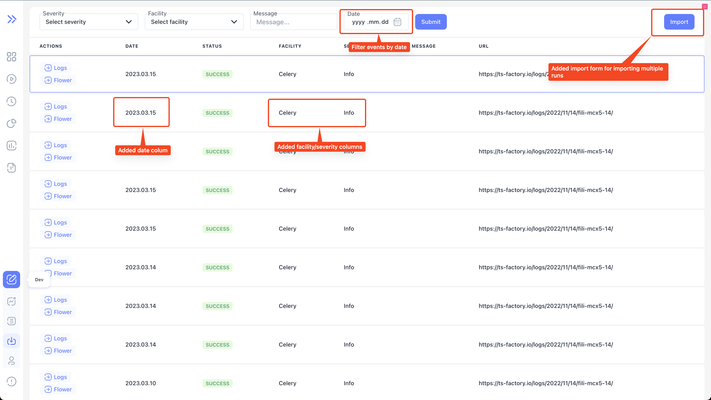
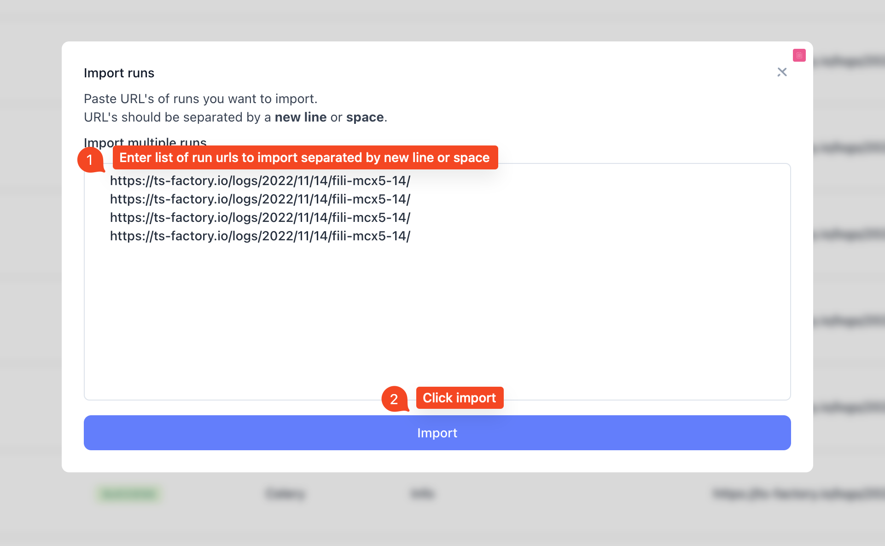
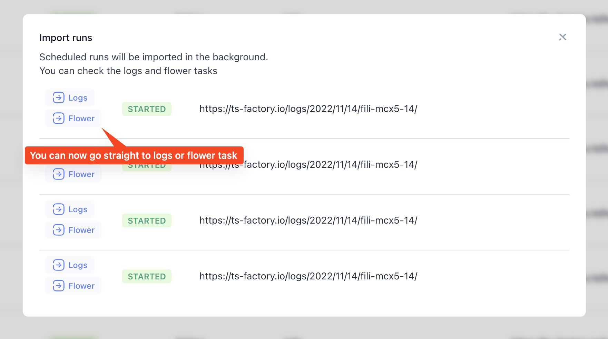

We are happy to announce **Bublik v0.1.3**

Added features, bugs and more!

<!--truncate-->

# Highlights

### Added more data to import event table

### New form for importing multiple runs at once

## Changelog

### Frontend

#### 🚀 New Feature

- feat(dashboard): expand nok result on link click for `unexpected`
- feat(import): added form for importing multiple runs at once
- feat(import): add filter by date to form

#### 🐛 Bug Fix

- fix(import): fix sidebar not sticking when table overflows page

#### 💅 Polish

- style(import): fix header dissapearing on when error present
- style(import): overflowing table should be scrollable
- chore(history): format dates in header legend

---

### Backend

#### 🚀 New Feature

#### 💾 DB changes

#### 🐛 Bug Fix

#### ✏️ Other
