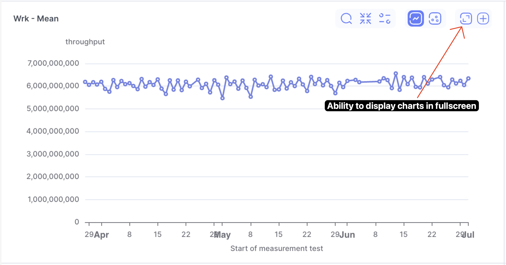
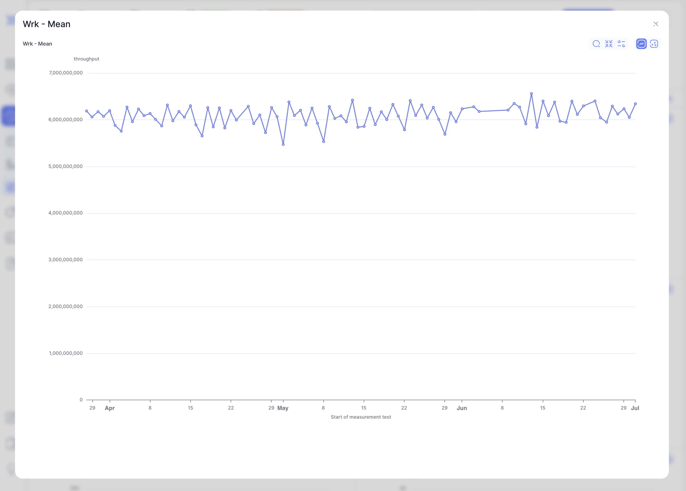
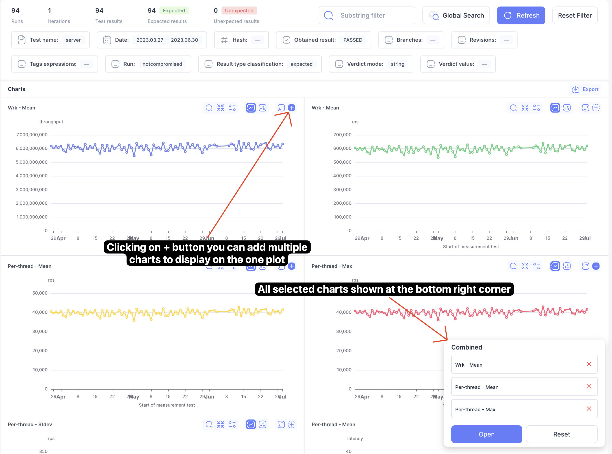
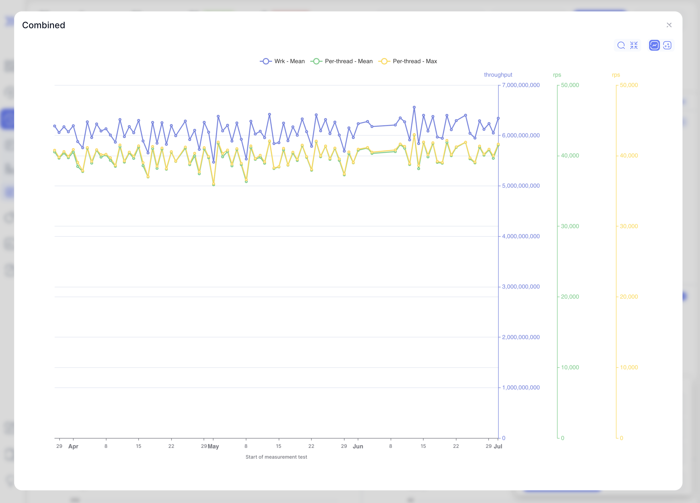
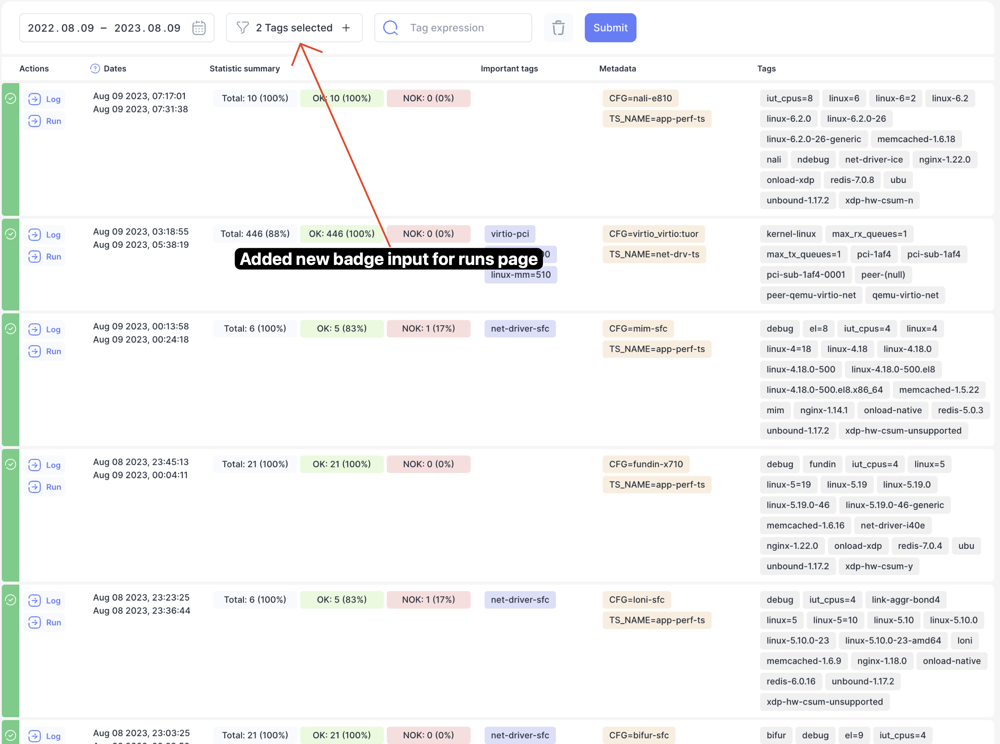
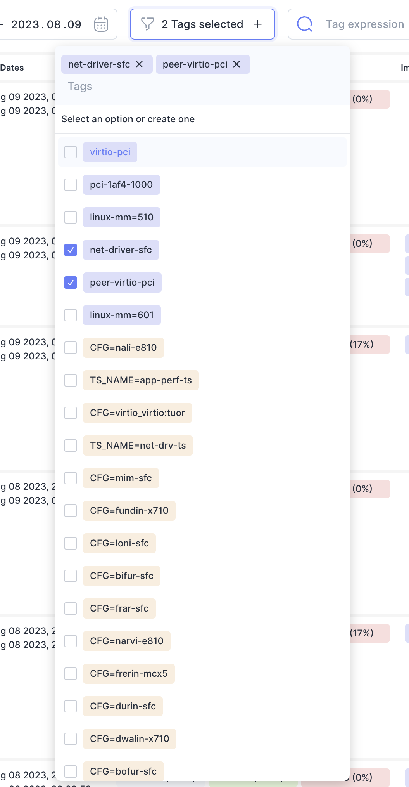
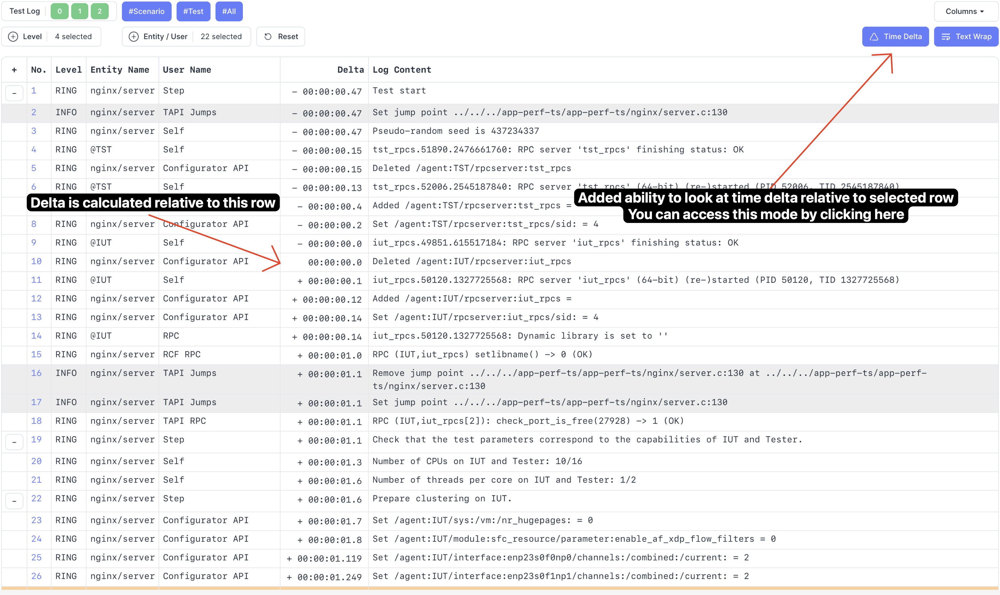

We are happy to announce **Bublik v0.1.8**.
In this release we focused mainly on improving charts usability.

<!--truncate-->

# Highlights

### Ability to open charts in fullscreen mode

You can now open most of the charts in fullscreen mode

### Ability to compose multiple charts onto one plot

:::info
We are considering moving this view to separate page to allow URL sharing
:::

### New runs badge input

We have added new badge input to runs page that should be working better then before.
We are currently looking at changing history badge input and moving it to separate modal with input looking like on the runs page.

### Time delta

:::caution
This is not final design and UI improvements would be made regarding colors
:::

## Changelog

### Frontend

#### 🐛 Bug Fix

- **log:** time delta not working correctly with timestamps ([e6ef2c4](https://github.com/oktetlabs/bublik-ui/commit/e6ef2c421524270dfa2df6d665c4183a46156f6f))
- **ui:** [tags-box-input] removing selected items ([ed6f41e](https://github.com/oktetlabs/bublik-ui/commit/ed6f41e0694e1d7e175176ec0ac2a6c750de1785))

#### ♻ Code Refactoring

- **ui:** [chart] replace chart toolbar with updated ([c3a6a30](https://github.com/oktetlabs/bublik-ui/commit/c3a6a301ab259e8ebf4ea6d5f26555d6d75f423e))

#### 💅 Polish

- **history:** [plot-list] add shadow to header when sticky ([0a4403f](https://github.com/oktetlabs/bublik-ui/commit/0a4403fdb1ef781a2749408105ada51964c37ee1))
- **history:** [refresh] fix animation origin ([23c81da](https://github.com/oktetlabs/bublik-ui/commit/23c81da367b1bb53a63b07d73b80dc234b405d14))
- **measurements:** improve measurements chart layout ([36d7ae9](https://github.com/oktetlabs/bublik-ui/commit/36d7ae931e61bdef94212b976de273b730bdfd9b))
- **ui:** [button] don't allow click when loading ([4cc0967](https://github.com/oktetlabs/bublik-ui/commit/4cc096763d405994db47a6b2648ec4cd3e6753b5))
- **ui:** [chart] add more space in fullscreen mode ([faac01e](https://github.com/oktetlabs/bublik-ui/commit/faac01ef49201280082c814a5e18d2529df5b401))
- **ui:** [export-button] fix icon and styles ([28d2cb3](https://github.com/oktetlabs/bublik-ui/commit/28d2cb3e8b10b3d6fc69e03ae40839f658bc3259))
- **ui:** [link] missing animation when loading ([5e6c55a](https://github.com/oktetlabs/bublik-ui/commit/5e6c55a02e2afaf26d0b3f44cf1d4488f104adfa))

#### 📦 Chores

- **log:** add timestamp mock ([b926195](https://github.com/oktetlabs/bublik-ui/commit/b9261956af3f2941ea982b511f3a348f1a34a583))
- **measurements:** [chart] remove plot with series ([012d1e4](https://github.com/oktetlabs/bublik-ui/commit/012d1e42558df2f2e9b514c96e9f3f845cfc5b45))
- **ui:** [chart] adjust icon sizes ([392a963](https://github.com/oktetlabs/bublik-ui/commit/392a9630a5a445aa92facb6cd3b109527ea74f70))
- **ui:** [chart] improve voice over labels ([cc97fc2](https://github.com/oktetlabs/bublik-ui/commit/cc97fc270c73de5087baea3e9ece4fb24cd0c05a))

#### 🚀 New Feature

- **history, measuremensts:** add fullscreen chart ([fda3f68](https://github.com/oktetlabs/bublik-ui/commit/fda3f68fad61fe0bbc557cf5f6c504933a24391e))
- **history:** [chart] add ability to view charts with multiple Y axises ([#456](https://github.com/oktetlabs/bublik-ui/issues/456)) ([5aa8ad0](https://github.com/oktetlabs/bublik-ui/commit/5aa8ad05272740568be1c54560f7edbcfd1b74e5))
- **ui:** [toolbar] add toolbar component ([aa142d5](https://github.com/oktetlabs/bublik-ui/commit/aa142d5ae970293ef932d30d47183e3fa42508c6))
- **log:** add timestamp delta with anchor ([616b73c](https://github.com/oktetlabs/bublik-ui/commit/616b73ce8524323f0ec64e53feb53ef2e9f5a6b1))

#### ✅ Tests

- **history, import:** update snapshot tests ([0fbda34](https://github.com/oktetlabs/bublik-ui/commit/0fbda347312595b0d930341ba66580aeffcdc4ab))
