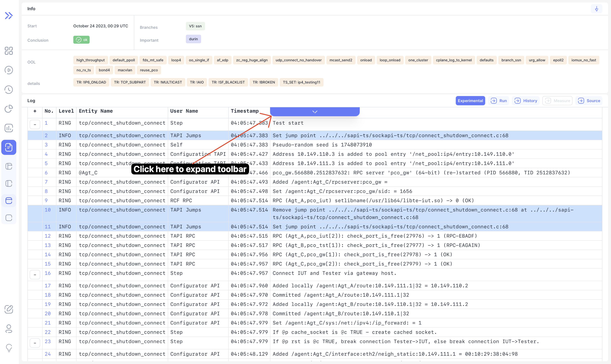
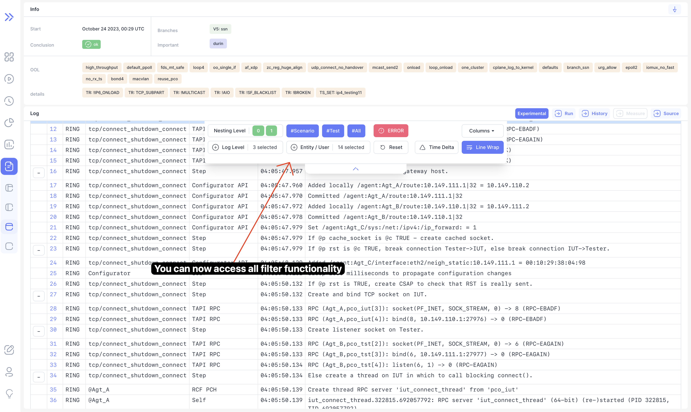
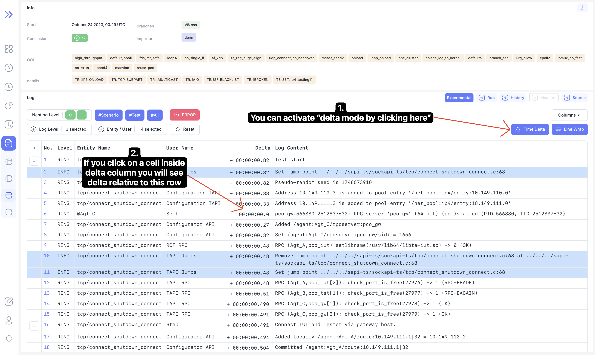
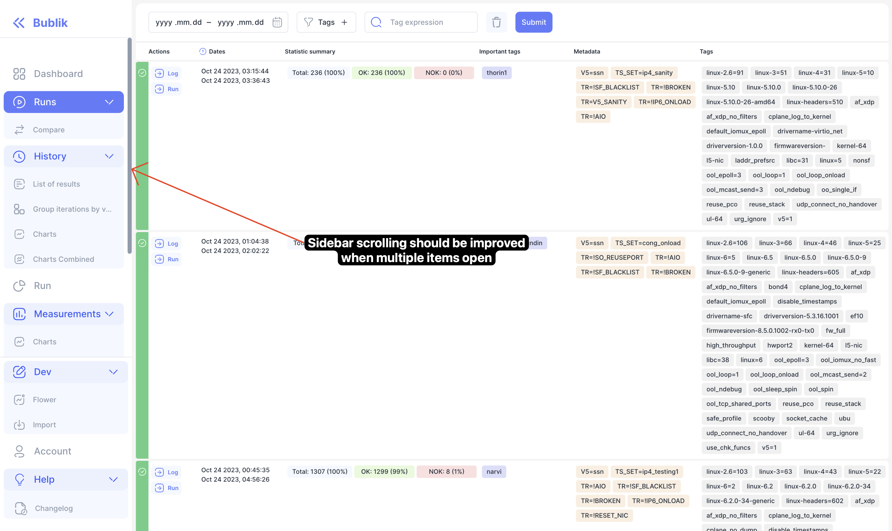
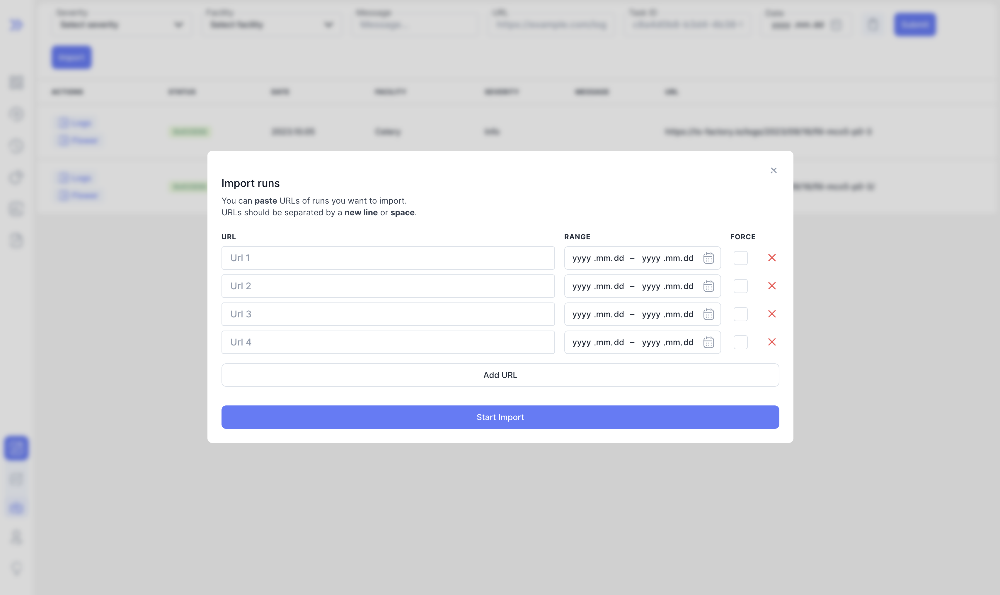

We are happy to announce **Bublik v0.1.10**.
In this release we focused mainly on improving existing pages and refining user experience

<!--truncate-->

# Highlights

### Floating log table filter toolbar

We've added toolbar floating toolbar at the top of log table to allow access to filters when scrolled after

### Log time

You can now see time delta relative to selected row if you enable "time delta mode"

### Improved sidebar scrolling

We improved sidebar scrolling

:::info
In collapsed state sidebar will expand links for active page only
:::

:::tip
You can press `S` on keyboard to open or collapse sidebar without clicking
:::

### Reworked import form

:::tip
You can paste multiple urls separated by space or newline character to prefill the form faster
:::

## Changelog

### Frontend

## [0.26.0](https://github.com/oktetlabs/bublik-ui/compare/v0.25.1...v0.26.0) (2023-10-20)

### 🚀 New Feature

- **router:** start loading whole app with spinner ([f1e2a79](https://github.com/oktetlabs/bublik-ui/commit/f1e2a79710731e7daf37e632e9c246c520f87988))
- **ui:** [form-alert]: add form alert component ([27ef388](https://github.com/oktetlabs/bublik-ui/commit/27ef3883fcd1df18c4b14e07022e2e249cc3b6e0))
- **ui:** [sidebar] improve scrollbar behaviour for sidebar ([310035e](https://github.com/oktetlabs/bublik-ui/commit/310035eb8cdc9be5305b7e489db838eeb3fe8c48))
- **log:** add floating toolbar ([5cf1c4a](https://github.com/oktetlabs/bublik-ui/commit/5cf1c4ad776f51a4d1a0c9a8f2ed61f9f6cabeb5))

### 🐛 Bug Fix

- **import:** base query not adding prefix in queryFn ([b4a3adc](https://github.com/oktetlabs/bublik-ui/commit/b4a3adccc97ea662711ba1d72f45bd19cfc41108))
- **log:** animation not working for highlighting row ([d1220bf](https://github.com/oktetlabs/bublik-ui/commit/d1220bf19c836ab8c260b5e57f499bc20e247fdd))
- **log:** properly handle errors from JSON api ([4d3e73a](https://github.com/oktetlabs/bublik-ui/commit/4d3e73a2e3bfd99ca7a27ad489da4945dcd7b795))
- **diff:** improve error message when no ids selected ([9da9af9](https://github.com/oktetlabs/bublik-ui/commit/9da9af9ec761d160c5f1e9f27da7418b07b282c9))
- **types:** remove runs config type from router ([4ba6852](https://github.com/oktetlabs/bublik-ui/commit/4ba6852d0a70a15dda9f42dd54aec5e609b05cf5))
- **auth:** [login-form] display error when invalid credentials provided ([c24a570](https://github.com/oktetlabs/bublik-ui/commit/c24a570c3036dc87b8a14370298e6afadc45faca))
- **run:** [page] not prefetching tree in log page ([9994167](https://github.com/oktetlabs/bublik-ui/commit/99941672e1ad59f7e59690bb1788bb83a05c7113))

### 📦 Chores

- **changelog:** [confetti] remove changelog modal ([9899025](https://github.com/oktetlabs/bublik-ui/commit/98990253f345db975a7866b261b80c5f2af009d9))
- **import:** add 4 default rows for import ([a9190bd](https://github.com/oktetlabs/bublik-ui/commit/a9190bda5f4f7d48d6aa37cbf376e991c1a21ca0))
- **sidebar:** remove tests link from sidebar ([d188ea7](https://github.com/oktetlabs/bublik-ui/commit/d188ea70a5bb57cb2eec7dd7a908cf627d08259a))
- **log:** change title of log level ([6991c01](https://github.com/oktetlabs/bublik-ui/commit/6991c01ddc068ace0ffe51c7e2e5159ddc475835))
- **nx:** migrate to latest nx ([7556574](https://github.com/oktetlabs/bublik-ui/commit/755657408b7c2bb4c39b9687bce652757487bf08))
- **ui:** fix some react keys logic ([14432d5](https://github.com/oktetlabs/bublik-ui/commit/14432d5ce28980d0a82c01447c61698f119b840f))
- cleanup old todos ([c9ddc48](https://github.com/oktetlabs/bublik-ui/commit/c9ddc484270117d7809813b586a4a1bc0f4dcc7a))

### 💅 Polish

- **dashboard:** fix border-radius not being consistent in header ([9711d95](https://github.com/oktetlabs/bublik-ui/commit/9711d95668f857686dc5fe27c86832bdfed7e070))
- **log:** fix floating button overlaying toolbar popovers ([f9415ad](https://github.com/oktetlabs/bublik-ui/commit/f9415add3d4930da305d7a366cbd8721c1c78bc2))
- **run:** add styles for sorted columns ([5bfb90d](https://github.com/oktetlabs/bublik-ui/commit/5bfb90da43717c097c0dc8a1b2c60e5d0a073043))
- **log:** add partially expanded row color ([09a0dc8](https://github.com/oktetlabs/bublik-ui/commit/09a0dc82d0e99fb57716299401bb2928b4427235))
- **log:** emphasize floating toolbar button styles ([75a24c0](https://github.com/oktetlabs/bublik-ui/commit/75a24c07250ed55286cc3bafc4b04262d17542d9))
- **log:** fix styling for wrapped file block ([ff187ca](https://github.com/oktetlabs/bublik-ui/commit/ff187ca40c3a5ad415a718b8fe4d005ec2ce3b7d))
- **log:** improve line breaking for pre-formatted elements ([06bfba5](https://github.com/oktetlabs/bublik-ui/commit/06bfba59a1d2bf53e06b7be52d9c5d5ed568d63c))
- **log:** improve word breaking ([8edd8ab](https://github.com/oktetlabs/bublik-ui/commit/8edd8ab8ae0c494840afcf4be916ebe956f18486))
- **log:** move log bgs to css variables ([4ef5d27](https://github.com/oktetlabs/bublik-ui/commit/4ef5d278e11ebd60e3c9c52e87ea27fd1ab76d19))
- **ui:** [button] missing border in disabled state ([e3f31b5](https://github.com/oktetlabs/bublik-ui/commit/e3f31b558ae234ed903ec3a816306af35411a278))
- **vars:** change all colors to hsl and allow opacity change ([15b9f1e](https://github.com/oktetlabs/bublik-ui/commit/15b9f1ed23d588d82b1b524dd8a384d8ba7a239f))
- **vars:** fixs overlay opacity ([c9e1824](https://github.com/oktetlabs/bublik-ui/commit/c9e1824982ffc0bf9d2c9461e8f05a3b9b9aa4cd))

### ♻ Code Refactoring

- **router:** remove all lazy loaded components ([52987d3](https://github.com/oktetlabs/bublik-ui/commit/52987d3ca361a21a922453917d1c8c5a28e33f36))
- **log:** expand log to level 1 by default ([adaa0d2](https://github.com/oktetlabs/bublik-ui/commit/adaa0d2e7f50daec870cfb020d0090539b9e8876))
- **log:** extract pagination logic into hooks ([518eccc](https://github.com/oktetlabs/bublik-ui/commit/518eccc8db0407bd0a2596773b96c957c3254b6c))
- **log:** improve error messages for JSON logs ([14adf94](https://github.com/oktetlabs/bublik-ui/commit/14adf949008618ee01194f4f5037ccb6fa620801))
- **log:** re-arrange log levels via weight parameter ([1a9fca0](https://github.com/oktetlabs/bublik-ui/commit/1a9fca0ba2c657dd25a86a3414fa8b245dda4929))

### ✅ Tests

- **ui:** update snapshot tests for new css vars ([4d5a9bb](https://github.com/oktetlabs/bublik-ui/commit/4d5a9bb1985abb0f68f177ef0c961d24ad5a70ea))
