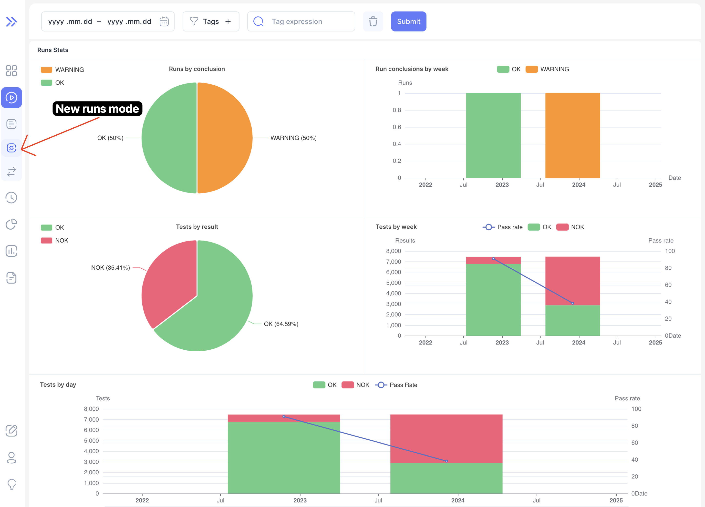
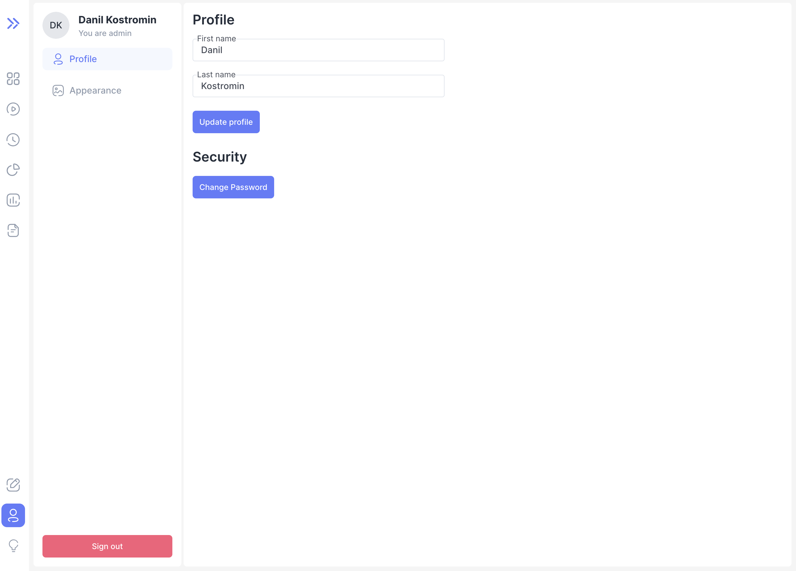
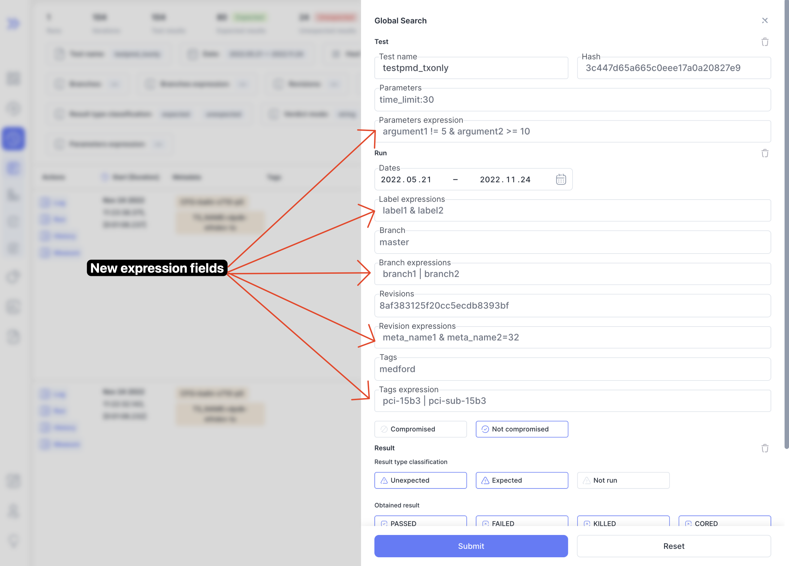
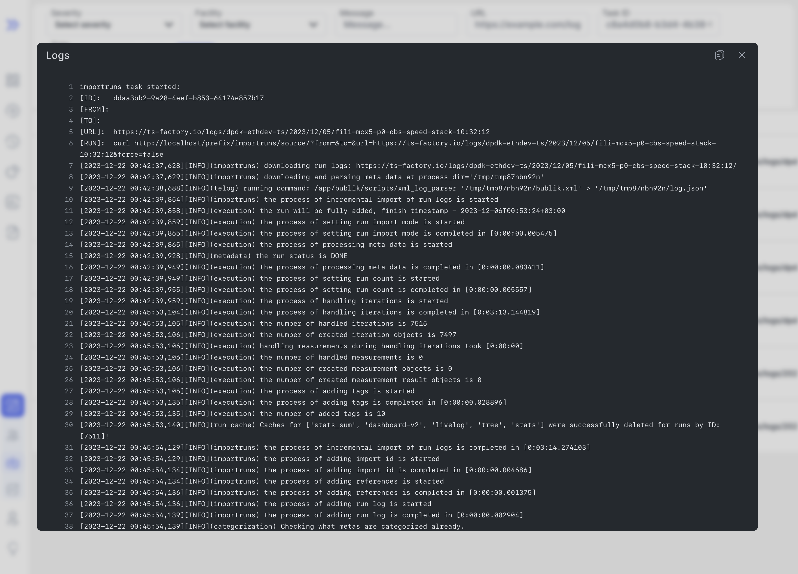

We are happy to announce **Bublik v0.2.1**.

<!--truncate-->

# Highlights

### Runs

We've added new mode for runs page which contains various charts to get an easy overview of filtered runs

:::info
Some charts are clickable
:::

### Authentication

In this release we've added authentication with access to profile and user management for admins

### Profile

### Admin

### History expressions

### Import logs

Integrated import logs

## Changelog

### Frontend

#### 🚀 New Feature

- **dashboard:** add popover button with icon and comment if run is marked as compromised ([35a3877](#))
- **dashboard:** add tv mode for dashboard for fullscreen viewing ([35a3877](#))
- **auth:** add authentication ([97da705](#))
- **auth:** add user profile page ([2fae3af](#))
- **import:** integrate import logs inside bublik ([35a3877](#))
- **history:** sync client filter state with search params ([35a3877](#))

#### 💅 Polish

- **ui** improve scrollbar behaviour when main container is overflowing ([bd3658f](#))
- **ui** convert all colors to HSL with support of opacity ([15b9f1e](#))
- **dashboard** replace dashboard mode icons with updated ones ([f1074b9](#))
- **dashboard** make dashboard errors to display properly ([f1074b9](#))

#### 🐛 Bug Fix

- **dashboard** failing recurcively on dashboard fetch error ([f1074b9](#))
- **dashboard** not refetching dashboard when run is marked as compromised ([f1074b9](#))
- **history** changing date in form and closing not picking correct date ([f1074b9](#))
- **history** changing mode when no page exists returns 404 ([f1074b9](#))

#### ♻ Code Refactoring

- **dashboard** refactor dashboard table as well as search params ([f1074b9](#))

#### 👷‍ Build System

- **ci** update ci/cd actions to latest versions ([f1074b9](#))

### Backend
